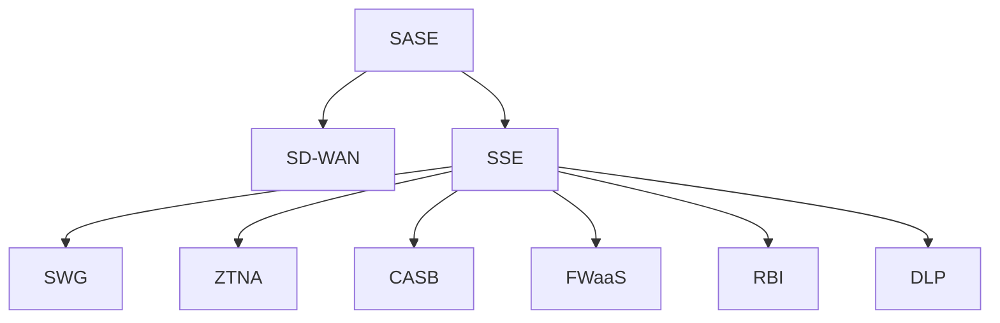

## 1. SASE

- FortiGate / FortiCNF
- FortiClient EMS
- FortiAnalyzer
- FortiManager

## 2. Application Security

Web Application and API Protection (WAAP)
- FortiADC
- FortiWeb

Application Development Security
- FortiDevSec
- FortiDAST (add-on to FortiDevSec)

## 3. Security Operations

- FortiMonitor
- FortiSIEM
- FortiSOAR
