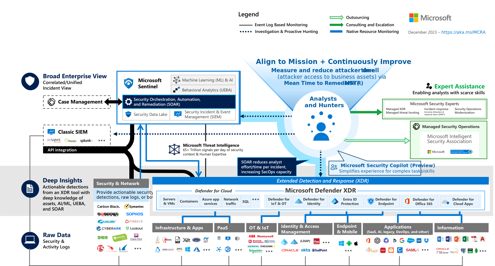
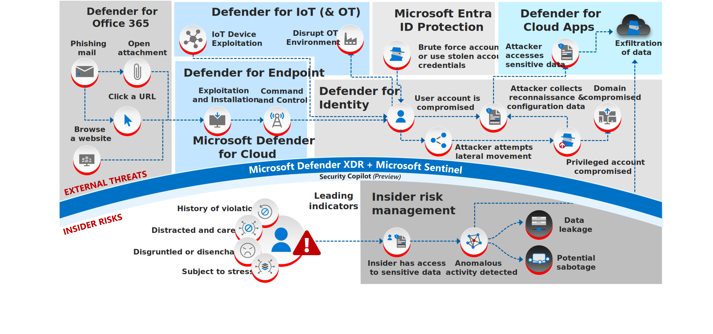
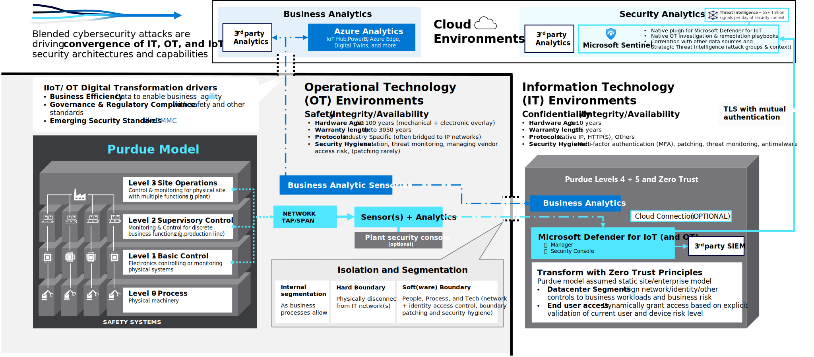

## 1. Microsoft Defender XDR

Microsoft Defender XDR is a solution that natively integrates multiple security solutions into one unified user experience (defender.microsoft.com, formerly security.microsoft.com)

https://learn.microsoft.com/en-us/defender-xdr/pilot-deploy-overview

### 1.1. Microsoft Defender for Endpoint

Previously _Microsoft Defender Advanced Threat Protection (MDATP)_

https://learn.microsoft.com/en-us/defender-endpoint/microsoft-defender-endpoint

### 1.2. Microsoft Defender for Office 365 (MDO)

- Comprises of [Exchange Online Protection](https://learn.microsoft.com/en-us/defender-office-365/eop-about) and Defender for Office 365 Plan 1 / Plan 2
- Identify and remediate email-based attacks, such as phishing, malware, and business email compromise
- Also has attack simulator to run realistic phishing attack simulations
- Previously _Office 365 Advanced Threat Protection (ATP)_

https://learn.microsoft.com/en-us/defender-office-365/protection-stack-microsoft-defender-for-office365

### 1.3. Microsoft Defender for Cloud Apps (MDA)

- CASB, previously _Microsoft office 365 Cloud App Security (MCAS)_
- SaaS Security Posture Management (SSPM) 

https://learn.microsoft.com/en-us/defender-cloud-apps/what-is-defender-for-cloud-apps

### 1.4. Microsoft Defender for Identity (MDI)

- Uses signals from on-premises AD DS and ADFS to identify, detect, and investigate attacks using UEBA (identifies anomalies with adaptive built-in intelligence), and direct threat detection of many attacks such as pass-the-hash, golden ticket, skeleton key, and more.
- Comprises of
  - Microsoft Defender portal
  - Defender for Identity sensor (installed on ADDS, ADFS and ADCS servers)
  - Defender for Identity cloud service (connected to Microsoft's intelligent security graph)

https://learn.microsoft.com/en-us/defender-for-identity/architecture

### 1.5. Microsoft Entra ID Protection

Evaluates the risk of each sign-in based on data from billions of sign-in attempt, then allow or prevent account access based on configured Conditional Access policies

https://learn.microsoft.com/en-us/entra/id-protection/overview-identity-protection

## 2. Microsoft Defender for Cloud (MDC)

CNAPP

https://www.microsoft.com/en-us/security/blog/2023/03/22/the-next-wave-of-multicloud-security-with-microsoft-defender-for-cloud-a-cloud-native-application-protection-platform-cnapp/

### 2.1. Cloud Security Posture Management (CSPM)

Provides visibility across multicloud and hybrid environments from development to runtime, provide alerts and recommendations to security teams on critical vulnerabilities and misconfigurations that could lead to issues, and have built-in workflows to strengthen security posture and help drive remediation (and at scale).

[CSPM](https://www.microsoft.com/security/business/cloud-security/microsoft-defender-cloud-security-posture-management) in MDC helps cut through the noise to focus on remediating your most critical risk with integrated insights across the SOC, DevOps, External Attack Surface Management (EASM), identity and access management, and compliance.

It has a single connected view in the cloud security graph with attack path analysis to help security teams identify exploitable resource paths and the built-in tools to mitigate risk across cloud environments.

### 2.2. Cloud Workload Protection Platform (CWPP)

Provides real-time detection and response to modern threats across your cloud workloads including virtual machines, containers and Kubernetes, databases, storage accounts, network layers, app Services, and more.

[CWP](https://www.microsoft.com/security/business/solutions/cloud-workload-protection) in MDC analyzes workloads using advanced analytics and threat intelligence to help reduce the attack surface and respond to emerging threats quickly.

The integrated experience with Microsoft 365 Defender and [Sentinel](https://www.microsoft.com/security/business/siem-and-xdr/microsoft-sentinel) enables a comprehensive detection and response solution for a modern security operations center.

CWP uses Azure Monitoring Agent (AMA) to collect data in hybrid and multi-cloud scenarios:
- Defender for Servers:
  - Azure Arc agent (for multi-cloud and on-premises servers)
  - MDE vulnerability assessment
  - AMA or Log Analytics agent
- Defender for SQL servers on machines:
  - Azure Arc agent (for multi-cloud and on-premises servers)
  - AMA or Log Analytics agent
  - Automatic SQL server discovery and registration
- Defender for Containers:
  - Azure Arc agent (for multi-cloud and on-premises servers)
  - Defender profile, Azure Policy Extension, Kubernetes audit log data

### 2.3. Unified DevOps security management

[Microsoft Defender for DevOps](https://www.microsoft.com/security/business/cloud-security/microsoft-defender-devops) in MDC empowers security teams to unify, strengthen, and manage multipipeline DevOps security, shift security left, and enable **code-to-cloud** protections in a central console.

This solution helps security teams rightfully focus on critical evolving threats by **securing Infrastructure as Code (IaC)** templates and container images to minimize cloud misconfigurations reaching production environments, and correlate contextual cloud security intelligence from runtime to dev platforms to prioritize remediation in code.

### 2.4. Cloud Infrastructure Entitlement Management (CIEM)

> Permissions give identities the ability to perform an action on a resource.
>
> Across major clouds, more than 40,000 permissions can be granted, of which over 50 percent are high risk, meaning they can cause service disruption, service degradation, or data leakage when used improperly.
>
> To help support a viable multicloud strategy and avoid accidental or malicious permission misuse, streamlined permissions management is essential.

[Microsoft Entra Permissions Management](https://www.microsoft.com/security/business/identity-access/microsoft-entra-permissions-management) helps you understand the real footprint of your cloud infrastructure entitlements, prevent permissions creep, and enforce the principle of least privilege across your multicloud environment.

MDC integrates with Permissions Management, enabling security teams to get unified visibility and recommendations in a central cloud security dashboard.

## 3. Microsoft Sentinel

SIEM and SOAR

### 3.1. Content Hub

Content and solutions support types:
- Microsoft-supported
- Partner-supported
- Community-supported

|Content Type|Description|
|---|---|
|[Data connectors](https://learn.microsoft.com/en-us/azure/sentinel/connect-data-sources)|Provide log ingestion from different sources into Microsoft Sentinel|
|[Parsers](https://learn.microsoft.com/en-us/azure/sentinel/normalization-about-parsers)|Provide log formatting/transformation into [Advanced Security Information Model (ASIM)](https://learn.microsoft.com/en-us/azure/sentinel/normalization) formats, supporting usage across various Microsoft Sentinel content types and scenarios|
|[Workbooks](https://learn.microsoft.com/en-us/azure/sentinel/get-visibility)|Provide monitoring, visualization, and interactivity with data in Microsoft Sentinel, highlighting meaningful insights for users|
|[Analytics rules](https://learn.microsoft.com/en-us/azure/sentinel/detect-threats-built-in)|Provide alerts that point to relevant SOC actions via incidents|
|[Hunting queries](https://learn.microsoft.com/en-us/azure/sentinel/hunting)|Used by SOC teams to proactively hunt for threats in Microsoft Sentinel|
|[Notebooks](https://learn.microsoft.com/en-us/azure/sentinel/notebooks)|Help SOC teams use advanced hunting features in Jupyter and Azure Notebooks|
|[Watchlists](https://learn.microsoft.com/en-us/azure/sentinel/watchlists)|Support the ingestion of specific data for enhanced threat detection and reduced alert fatigue|
|[Playbooks and Azure Logic Apps custom connectors](https://learn.microsoft.com/en-us/azure/sentinel/automate-responses-with-playbooks)|Provide features for automated investigation, remediation, and response scenarios in Microsoft Sentinel|

### 3.2. SOAR

Sentinel SOAR is organized into two distinct layers – automation and playbooks:
- Automation layer enables analysts to centrally manage incident handling through automation rules
- Sentinel playbook (built on top of Azure Logic Apps) is a collection of response and remediation actions and logic that can be executed within Microsoft Sentinel as a routine

https://learn.microsoft.com/en-us/azure/sentinel/automation/automation

### 3.3. Microsoft Sentinel versus Microsoft Defender XDR

- **Data ingestion**:
  - Sentinel: configure data collection based on your needs and ingest data from Azure, multi-cloud environments, on-premises, and so on.
  - XDR: receive data mainly from Defender solutions: MDE, MDO, MDA, MDI, and MDC, as well as Entra ID Protection.
- **Threat detection and investigation**:
  - Both solutions provide advanced capabilities for threat detection.
  - The major difference: Sentinel’s wider support for Azure and third-party data sources including the Fusion detection engine (advanced multistage attack detection) → better correlations with multiple data sources.
- **Data retention**:
  - Maximum data retention:
    - XDR: 180 days
    - Sentinel: up to 12 years.
  - Sentinel, or the underlying Azure Log Analytics, is not the ideal place for long-term storage of logs. The Azure Monitor data retention and archive or Azure Data Explorer are better suited for long-term retention.
- **Automation**:
  - XDR: AIR capabilities for MDE, MDO, and MDI (and for MDA with custom policies)
  - Sentinel: wide range of automation capabilities (SOAR). This is established in two layers: the automation layer and custom playbooks that are built on top of Azure Logic Apps.
- **Advanced UEBA capabilities**:
  - XDR: UEBA capabilities from MDA and MDI
  - Sentinel: advanced UEBA capabilities; UEBA raw data is also available for threat hunting or investigation.
- **Threat hunting**:
  - XDR: data from MDE, MDO, MDI, MDA and Entra ID only, but has advanced hunting that can be used in two different ways: building KQL queries from scratch or with the query builder, which is helpful if the user is not an expert in creating KQL queries.
  - Sentinel: can ingest data from third-party data sources, and has Jupyter Notebook integration for advanced scenarios.
- **Threat intelligence (TI)**:
  - XDR: TI capabilities are out-of-the-box features and it provides information on the Threat Analytics dashboard and uses it when analyzing threats.
  - Sentinel: can ingest data from various TI platforms. In addition, Microsoft Defender TI can be ingested for free, even if your organization didn’t purchase the Microsoft Defender TI solution.

## 4. Others

### 4.1. Microsoft Defender for IoT

From CyberX acquisition

- **Agentless monitoring**: It does not require any software installation or configuration on IoT devices, which reduces the risk of performance or compatibility issues
- **Behavioral analytics**: It uses ML and AI to analyze the normal behavior of IoT devices and networks and detect any anomalies or deviations that indicate a potential attack
- **Automated response**: It can automatically block or isolate malicious devices, or trigger alerts and actions in other security tools, such as firewalls, SIEMs, or ticketing systems
- **Cloud scalability**: It can scale up or down according to the size and complexity of the IoT environment
- **Integrations**: It has native integrations with Microsoft Security solutions such as Microsoft Defender XDR and Microsoft Sentinel

### 4.2. External Attack Surface Management (EASM)

From RiskIQ acquisition

- Discover and monitor the external attack surface and prioritize the remediation of vulnerabilities.
- Scans the internet for assets that belong to or are associated with an organization, such as domains, IP addresses, certificates, web servers, and cloud services.
- Analyzes these assets for vulnerabilities, misconfigurations, and other risks that could be exploited by attackers.
- Native integration with Azure Log Analytics and Azure Data Explorer, which allows organizations to leverage EASM data in Sentinel.
  - Flexibility to choose between migrating asset data, attack surface insights, or both data types.
    - Asset data offers comprehensive details about the entire inventory
    - Attack surface insights deliver actionable information through Defender EASM dashboards

### 4.3. Microsoft Defender Threat Intelligence (MDTI)

- Collects and analyzes data from millions of sources, including Microsoft’s own products and services, third-party vendors, open source platforms, and partner networks
- Uses advanced algorithms and models to identify patterns, trends, and anomalies in the threat landscape, and to prioritize the most relevant and urgent threats for each organization
- Provides customized and contextualized intelligence reports, alerts, and recommendations that are tailored to the specific needs and preferences of each organization.
- Enables organizations to automate and orchestrate their threat response and remediation processes, using built-in tools and integrations with other Microsoft security solutions

### 4.4. Microsoft Security Copilot

https://learn.microsoft.com/en-us/copilot/security/microsoft-security-copilot#security-copilot-primary-use-cases

- **Analyze scripts and codes**

  Many sophisticated attacks (such as ransomware) contain scripts or code that can be very difficult to evaluate. Copilot for Security provides script analysis capability to support analysis.

- **Use guided responses**

  The guided response during investigation provides recommended actions for analysts during investigation. This process is powered by AI and helps analysts  decide how to proceed with incident triaging, investigation, remediation, and containment.

- **Generate KQL queries**
  - **Advanced Hunting** is one of the Microsoft Defender XDR core features and provides two options to create queries:
    - Manually in the editor (for advanced users)
    - Using the query builder to get more guidance on the creation process
  - Copilot for Security helps with this area as well. The security analyst can ask Copilot for Security to create a KQL query using their natural language, which reduces the barrier for people who are not so familiar with KQL.

- **Create incident reports**
  - In SOC teams, creating reports about incidents is one of the core tasks undertaken on a regular basis. Copilot for Security assists with writing incident reports more efficiently.
  - While an incident summary describes how the incident occurred and provides an overview of it, an incident report aggregates information from diverse data sources within **Microsoft Sentinel and Microsoft Defender XDR**. It encompasses both analyst-initiated procedures and automated actions, providing a comprehensive overview of the incident.

## 5. Reference architectures

### 5.1. Security Operations

### 5.2. Attack Chain

### 5.3. OT Security

Apply zero trust principles to securing OT and industrial IoT environments

