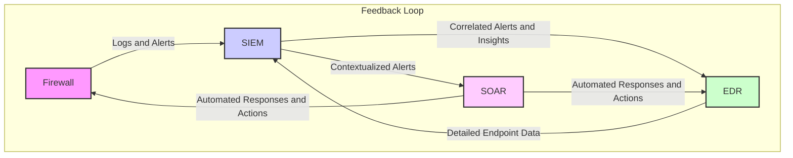

# 1. Integration between firewall, EDR, SIEM and SOAR

Integration of Firewall, EDR, SIEM, and SOAR creates a robust security ecosystem, enhancing threat detection, response, and overall operational efficiency.

## 1.1. Integration Overview

- **Purpose of Integration:**
  - To create a cohesive security ecosystem where data and alerts are shared seamlessly.
  - To enhance detection, response, and compliance by leveraging the strengths of each tool.

## 1.2. Example Integration Scenario

**Scenario:** A company’s network has been compromised by an advanced persistent threat (APT). Here's how each tool contributes to detecting and mitigating the threat:

### A. Firewall and SIEM Integration

- **How It Works:**
  - **Firewall Logs:** Firewalls generate logs of network traffic, including allowed and denied connections, potential threats, and policy violations.
  - **SIEM Aggregation:** These logs are collected by the SIEM system, which aggregates and correlates data from various sources.
  
- **Example:**
  - **Firewall Alert:** The firewall detects unusual traffic patterns indicative of a potential data exfiltration attempt.
  - **SIEM Correlation:** The SIEM correlates this firewall alert with other logs (e.g., user login activities) and identifies a pattern consistent with a known APT signature.

- **Benefit:**
  - **Enhanced Visibility:** SIEM’s ability to correlate logs from the firewall with other data sources helps in identifying sophisticated threats that might not be apparent from a single log source.

### B. EDR and SIEM Integration

- **How It Works:**
  - **EDR Detection:** EDR solutions monitor endpoints for suspicious behaviors such as unusual file modifications, process executions, or network connections.
  - **SIEM Correlation:** EDR alerts are sent to the SIEM, which correlates these with other security data to provide context.

- **Example:**
  - **EDR Alert:** An endpoint detects and flags a malicious executable trying to connect to an external IP address.
  - **SIEM Analysis:** The SIEM correlates this endpoint alert with firewall logs indicating communication with a known bad IP address and previous suspicious login attempts.

- **Benefit:**
  - **Contextualized Threat Detection:** SIEM enriches EDR data with additional context, improving threat analysis and prioritization.

### C. SOAR and SIEM Integration

- **How It Works:**
  - **SIEM Alerts:** SIEM generates alerts based on correlated data and detected anomalies.
  - **SOAR Automation:** SOAR platforms can ingest these alerts and automate responses based on predefined workflows and playbooks.

- **Example:**
  - **SIEM Alert:** The SIEM detects a pattern of suspicious activity consistent with a ransomware attack.
  - **SOAR Response:** The SOAR system automatically triggers a response, such as isolating affected systems, blocking malicious IP addresses, and notifying the security team.

- **Benefit:**
  - **Automated Response:** SOAR automates repetitive tasks, reducing response times and minimizing the impact of incidents.

### D. Firewall and SOAR Integration

- **How It Works:**
  - **Firewall Policy Enforcement:** SOAR platforms can interact with firewalls to dynamically adjust policies based on ongoing threats.
  - **Automated Policy Adjustments:** For example, SOAR can create firewall rules to block malicious IPs detected during an incident.

- **Example:**
  - **SOAR Alert:** During an incident, SOAR identifies a malicious IP address through threat intelligence.
  - **Firewall Action:** SOAR sends a command to the firewall to block traffic from this IP address.

- **Benefit:**
  - **Dynamic Defense:** SOAR enables real-time adjustments to firewall rules based on emerging threats, enhancing protection.

### E. EDR and SOAR Integration

- **How It Works:**
  - **Endpoint Data:** EDR tools provide detailed data on endpoint activities and threats.
  - **SOAR Automation:** SOAR can use this data to automate responses, such as isolating endpoints or performing forensic analysis.

- **Example:**
  - **EDR Detection:** EDR detects a malware infection on a workstation.
  - **SOAR Response:** SOAR initiates a predefined response, such as quarantining the infected endpoint and initiating a forensic investigation.

- **Benefit:**
  - **Streamlined Incident Handling:** SOAR automates complex incident response procedures based on detailed EDR insights.

## 1.3. Benefits of Integration

- **Comprehensive Threat Detection:** Combining data from Firewalls, EDR, and SIEM provides a more complete view of potential threats.
- **Efficient Incident Response:** SOAR automates and orchestrates responses, reducing manual effort and response time.
- **Improved Compliance and Governance:** Integrated solutions ensure that security policies are enforced and compliance requirements are met effectively.
- **Enhanced Operational Efficiency:** Streamlined processes and automated tasks reduce the burden on security teams and optimize resource use.

## 1.4. Best Practices for Integration

- **Ensure Compatibility:** Verify that tools can communicate effectively and share data seamlessly.
- **Define Clear Workflows:** Establish well-defined processes for how each tool interacts and contributes to incident handling.
- **Regularly Update:** Keep all systems up-to-date to ensure they work together effectively and can handle emerging threats.

# 2. Combination of Firewall, EDR, SIEM, and SOAR forms a comprehensive feedback loop in security operations

The security feedback loop is a continuous process where each component—Firewall, EDR, SIEM, and SOAR—feeds information and actions into the next, enabling a dynamic and responsive security environment. This loop helps in improving security measures over time by learning from past incidents and optimizing responses.

## 2.1. Initial Detection and Data Collection

**Firewall:**
- **Function:** Monitors and controls network traffic based on security policies. It logs traffic data and detects suspicious activities or policy violations.
- **Output:** Logs and alerts on potential threats or unusual traffic patterns.

**EDR:**
- **Function:** Monitors endpoints for suspicious behaviors and anomalies. It provides detailed visibility into endpoint activities.
- **Output:** Alerts and data on endpoint-related threats, such as malware or unauthorized access attempts.

**SIEM:**
- **Function:** Aggregates and correlates data from various sources, including Firewalls, EDRs, and other security tools. It analyzes this data to identify patterns and generate alerts.
- **Output:** Correlated alerts and comprehensive security insights based on aggregated logs.

**SOAR:**
- **Function:** Orchestrates and automates responses based on alerts and data from SIEM. It can interact with Firewalls, EDRs, and other tools to manage and mitigate threats.
- **Output:** Automated actions and incident management processes.

## 2.2. Analysis and Correlation

**SIEM:**
- **Function:** Analyzes data from Firewalls, EDRs, and other sources to correlate events and identify potential threats.
- **Feedback to EDR/Firewall:** Provides insights into patterns that may indicate broader threats or vulnerabilities.

**EDR:**
- **Function:** Provides detailed endpoint data for further analysis. EDR can also use SIEM insights to focus on specific threat indicators.
- **Feedback to SIEM:** Provides detailed context on endpoint threats that SIEM can use for more refined analysis.

**SOAR:**
- **Function:** Utilizes insights from SIEM to automate responses. It can adjust actions based on the severity and nature of the threat identified by SIEM.
- **Feedback to EDR/Firewall:** Adjusts configurations or policies based on the automated response and new threat information.

## 2.3. Response and Remediation

**SOAR:**
- **Function:** Executes automated responses such as isolating affected endpoints, blocking IP addresses, or applying firewall rules.
- **Feedback to Firewall/EDR:** Adjusts firewall rules or endpoint configurations based on the response actions taken.

**Firewall:**
- **Function:** Implements changes in network policies as directed by SOAR. It can block or allow traffic based on new rules.
- **Feedback to SIEM/EDR:** Updates SIEM and EDR with the new network policies and potential changes in traffic patterns.

**EDR:**
- **Function:** Takes actions such as quarantining infected files or blocking malicious processes. It also provides updates on the status of these actions.
- **Feedback to SIEM/SOAR:** Reports on the results of response actions, helping SIEM to refine its analysis and SOAR to adjust its workflows.

## 2.4. Continuous Improvement

**SIEM:**
- **Function:** Provides insights and reports that can be used to refine detection rules, improve correlation techniques, and update threat intelligence.
- **Feedback Loop:** Uses new threat information and response effectiveness to improve detection and analysis.

**SOAR:**
- **Function:** Continuously updates and optimizes response workflows based on feedback from the effectiveness of past responses and current threat intelligence.
- **Feedback Loop:** Ensures that response strategies evolve based on new threats and operational data.

**Firewall/EDR:**
- **Function:** Receives updated policies or configurations from SOAR and improved detection rules from SIEM.
- **Feedback Loop:** Enhances its monitoring and enforcement capabilities based on ongoing feedback.

## 2.5. Visualizing the Feedback Loop

1. **Detection:**
   - **Firewall/EDR Logs & Alerts → SIEM Aggregation & Correlation**

2. **Analysis:**
   - **SIEM Insights → EDR Contextualization → SOAR Actions**

3. **Response:**
   - **SOAR Automated Response → Firewall/EDR Adjustments**

4. **Continuous Improvement:**
   - **Feedback from Actions → SIEM Updates → SOAR Workflow Refinements**

## 2.6. Benefits of the Feedback Loop

- **Enhanced Threat Detection:** Improved ability to detect complex threats through correlation of data from multiple sources.
- **Faster Response:** Automated and orchestrated responses reduce the time needed to mitigate threats.
- **Adaptive Security Posture:** Continuous feedback and updates refine security measures, enhancing overall effectiveness.
- **Operational Efficiency:** Streamlined processes and automated responses reduce manual effort and improve resource utilization.

By integrating these tools into a cohesive feedback loop, organizations can create a dynamic and adaptive security environment that continuously improves in response to new threats and evolving security challenges.

# 3. Multi-Tenant Feedback Loop Overview

In a multi-tenant environment, the feedback loop formed by integrating Firewall, EDR, SIEM, and SOAR can create a more powerful and holistic security ecosystem.

In a multi-tenant security architecture, a master tenant (or central management) oversees and coordinates security operations across several sub-tenants (individual clients or departments).

This approach allows for centralized management while addressing the specific needs of each sub-tenant. The integration of Firewall, EDR, SIEM, and SOAR in this context enhances security by sharing and leveraging data across all tenants.

This setup not only enhances security for each individual tenant but also leverages the collective intelligence and data from all tenants to improve overall protection. Here’s how this extended feedback loop works in a multi-tenant approach and why it creates stronger synergy:

## 3.1. Centralized Data Collection and Analysis

**Firewall Integration:**
- **Master Tenant:** The central management system aggregates firewall logs and alerts from all sub-tenants.
- **Sub-Tenants:** Each sub-tenant’s firewall provides localized logs and threat data.

**SIEM Integration:**
- **Centralized SIEM:** Collects and correlates data from firewalls, EDRs, and other sources across all tenants.
- **Enhanced Correlation:** By analyzing data from multiple tenants, the SIEM can identify broader attack patterns or trends that may affect multiple tenants.

**Example:**
- A suspicious IP address detected by the firewall in one tenant’s network may be identified as a known threat in the SIEM, which then alerts all tenants about the potential risk, providing context to each tenant’s security operations.

## 3.2. Cross-Tenant Threat Detection and Response

**EDR Integration:**
- **Master Tenant:** Aggregates endpoint data from all sub-tenants, enabling the detection of cross-tenant threats.
- **Sub-Tenants:** Provides detailed endpoint activity data and alerts.

**SOAR Integration:**
- **Centralized SOAR:** Automates responses based on alerts from the SIEM, including actions across multiple tenants.
- **Cross-Tenant Actions:** SOAR can execute coordinated response actions, such as blocking malicious IPs or isolating compromised endpoints, affecting all tenants if needed.

**Example:**
- If malware is detected on an endpoint in one tenant’s environment, SOAR can initiate an automated response that blocks the threat across all tenant networks and updates firewall rules to prevent further spread.

## 3.3. Enhanced Intelligence Sharing

**SIEM Insights:**
- **Cross-Tenant Intelligence:** SIEM provides centralized intelligence that includes threat patterns and indicators of compromise (IoCs) observed across all tenants.
- **Shared Learning:** Lessons learned from incidents in one tenant can improve security measures for all tenants.

**SOAR Actions:**
- **Adaptive Playbooks:** SOAR workflows are updated with new intelligence and threat patterns identified across tenants, improving response strategies.
- **Coordinated Defense:** Automated responses and adjustments are based on collective data, enhancing the security posture for all tenants.

**Example:**
- Anomalous behavior detected in one tenant might lead to an update in threat intelligence shared across all tenants, leading to improved detection rules and response procedures.

## 3.4. Holistic Security Management

**Master Tenant Oversight:**
- **Centralized Control:** The master tenant manages and monitors security across all sub-tenants, ensuring consistent policies and responses.
- **Consolidated Reporting:** Provides comprehensive security reports and compliance status for all tenants.

**Sub-Tenant Customization:**
- **Localized Adjustments:** While benefiting from centralized intelligence, each sub-tenant can have tailored security policies and configurations to address specific needs.

**Example:**
- The master tenant might enforce a baseline security policy for all sub-tenants but allow individual sub-tenants to customize specific rules based on their unique risk profiles.

## 3.5. Benefits of Multi-Tenant Feedback Loop

1. **Increased Threat Visibility:**
   - **Holistic View:** Centralized SIEM and EDR provide a comprehensive view of threats across all tenants, improving the detection of cross-tenant attacks.

2. **Improved Response Coordination:**
   - **Unified Actions:** SOAR automates and orchestrates responses that benefit all tenants, reducing the risk of coordinated attacks spreading across multiple environments.

3. **Enhanced Threat Intelligence:**
   - **Shared Knowledge:** Threat intelligence and incident insights are shared across tenants, leading to more robust defenses and better-informed security strategies.

4. **Operational Efficiency:**
   - **Streamlined Management:** Centralized security management and automation reduce overhead and improve response times, benefiting all tenants.

5. **Compliance and Governance:**
   - **Centralized Oversight:** Simplified compliance reporting and governance through centralized management and consolidated data.

## 3.6. Visualizing the Multi-Tenant Feedback Loop

1. **Detection:**
   - **Firewalls (All Tenants) → Centralized SIEM Aggregation**

2. **Analysis:**
   - **SIEM Correlation (Cross-Tenant) → EDR Contextualization**

3. **Response:**
   - **SOAR Automated Actions (All Tenants) → Firewall and EDR Adjustments**

4. **Continuous Improvement:**
   - **Feedback from All Tenants → SIEM Updates → SOAR Refinements**

## 3.7. Conclusion

In a multi-tenant environment, integrating Firewall, EDR, SIEM, and SOAR into a feedback loop creates a synergistic effect that significantly enhances the overall security posture. By leveraging collective data and intelligence across all tenants, this approach improves threat detection, response, and operational efficiency, providing a robust and adaptive security framework for all stakeholders.

# 4. Advantages of a Single Vendor Solution

Adopting a single vendor solution for Firewall, EDR, SIEM, and SOAR components can indeed offer significant advantages in terms of operational focus and coordinated response. Here’s a detailed analysis of how a single vendor approach enhances the effectiveness of security operations:

## 4.1. Unified Architecture and Integration

- **Seamless Integration:**
  - **Description:** When all components come from the same vendor, they are designed to work together out-of-the-box with minimal integration effort.
  - **Benefit:** Reduces the complexity and potential issues associated with integrating disparate systems. Ensures that all components are optimized to interact seamlessly, leading to more efficient data sharing and response coordination.

- **Consistent Data Formats:**
  - **Description:** The vendor's tools use consistent data formats and protocols, simplifying data aggregation and analysis.
  - **Benefit:** Enhances the accuracy of data correlation and threat detection. Avoids issues related to data incompatibility and translation errors.

## 4.2. Streamlined Operational Management

- **Centralized Management Console:**
  - **Description:** A single vendor solution typically provides a unified management console for monitoring and configuring all security components.
  - **Benefit:** Simplifies administration by consolidating management tasks into one interface. Reduces the learning curve and operational overhead associated with using multiple tools.

- **Unified Policies and Rules:**
  - **Description:** Security policies, rules, and configurations are uniformly applied across all components.
  - **Benefit:** Ensures consistency in security policies and reduces the risk of misconfigurations that can arise from using different vendors.

## 4.3. Coordinated Incident Response

- **Integrated Playbooks:**
  - **Description:** The same vendor provides pre-built playbooks and response workflows tailored for their suite of products.
  - **Benefit:** Ensures that playbooks are optimized for the specific capabilities of the tools, leading to more effective and efficient incident handling.

- **Automated Workflows:**
  - **Description:** SOAR solutions from the same vendor are designed to automate responses across their integrated security components.
  - **Benefit:** Streamlines and accelerates the response process. Automated workflows can be more precisely tuned to the interactions and data from the vendor's other tools.

## 4.4. Enhanced Visibility and Reporting

- **Holistic View:**
  - **Description:** A single vendor solution offers a consolidated view of security events and incidents.
  - **Benefit:** Provides comprehensive insights into security posture and incident trends without the need for complex cross-tool reporting.

- **Integrated Reporting:**
  - **Description:** Reporting tools are designed to work seamlessly with the vendor's components.
  - **Benefit:** Simplifies compliance reporting and governance by providing unified reports that cover all aspects of security.

## 4.5. Improved Support and Maintenance

- **Single Point of Contact:**
  - **Description:** Having all components from a single vendor means dealing with one support entity.
  - **Benefit:** Simplifies support and troubleshooting processes. Streamlines the resolution of issues, as the vendor’s support team is familiar with the entire suite of products.

- **Coordinated Updates and Patches:**
  - **Description:** Updates and patches are coordinated across all components.
  - **Benefit:** Ensures that all components are updated simultaneously, reducing the risk of compatibility issues and security gaps.

## 4.6. Enhanced Security Posture

- **Optimized Threat Intelligence:**
  - **Description:** Threat intelligence is integrated across all components from the same vendor.
  - **Benefit:** Provides a more accurate and comprehensive understanding of threats, leading to better-informed defense strategies.

- **Unified Response Strategies:**
  - **Description:** Security strategies are designed with a holistic view of the vendor’s toolset.
  - **Benefit:** Allows for more coherent and effective security measures that leverage the full capabilities of the vendor’s solutions.

## 4.7. Example Scenario: Incident Management with a Single Vendor Solution

**Incident Detection:**
- **Firewall Alert:** The firewall detects unusual traffic patterns and sends alerts to the SIEM.

**Data Aggregation:**
- **SIEM Correlation:** The SIEM correlates firewall alerts with EDR data to identify a potential security breach.

**Response Automation:**
- **SOAR Workflow:** SOAR automatically initiates a response based on predefined playbooks, which include isolating the affected endpoints via EDR and blocking suspicious IP addresses via the firewall.

**Follow-Up and Reporting:**
- **Integrated Reporting:** The SIEM generates a unified incident report detailing the actions taken by the SOAR and the status of the affected systems.

**Continuous Improvement:**
- **Feedback Loop:** The insights gained from the incident are used to refine the playbooks and detection rules in the SIEM, improving future responses.

## 4.8. Conclusion

Adopting a single vendor solution for Firewall, EDR, SIEM, and SOAR components offers a more focused and well-coordinated approach to security operations. By integrating tools from the same vendor, organizations benefit from seamless integration, streamlined management, and coordinated incident response. This holistic approach enhances operational efficiency, improves threat detection and response, and simplifies support and maintenance, ultimately strengthening the organization’s overall security posture.

# 5. Diagrams

## 5.1. Firewall, EDR, SIEM and SOAR

### 5.1.1. **Diagram Description**

- **Firewall**: Monitors and logs network traffic, generating alerts for potential threats.
- **SIEM**: Aggregates and correlates data from Firewalls and other sources. Provides insights and alerts.
- **EDR**: Monitors endpoint activities and provides detailed data on threats. Receives contextualized alerts from SIEM.
- **SOAR**: Automates responses based on insights from SIEM and data from EDR. Implements actions to mitigate threats, which can include updating firewall rules or isolating endpoints.

### 5.1.2. **Diagram Flow**

1. **Firewall** sends logs and alerts to **SIEM**.
2. **SIEM** processes and correlates these alerts with other data sources and provides insights to **EDR**.
3. **EDR** analyzes endpoint data and returns detailed threat information to **SIEM**.
4. **SIEM** sends contextualized alerts to **SOAR**.
5. **SOAR** automates responses, which can involve actions such as adjusting firewall settings or isolating endpoints. These actions affect both **Firewall** and **EDR**.
6. The feedback loop continues as the automated actions from **SOAR** update the **Firewall** and **EDR**, which then influence future data collected by **SIEM**.

This diagram effectively illustrates the interplay and feedback mechanisms between the different security components, showing how they work together to enhance overall security operations.

## 5.2. Multi-tenant

In a multi-tenant environment, the feedback loop involves a master tenant that oversees several sub-tenants. Each component—Firewall, EDR, SIEM, and SOAR—operates across all tenants, with data and insights shared to improve security across the entire system.

```mermaid
graph TD
    subgraph Master Tenant
        M_F[Firewall]
        M_S[SIEM]
        M_SO[SOAR]
    end
    
    subgraph Tenant A
        A_F[Firewall]
        A_E[EDR]
    end
    
    subgraph Tenant B
        B_F[Firewall]
        B_E[EDR]
    end
    
    subgraph Tenant C
        C_F[Firewall]
        C_E[EDR]
    end
    
    %% Data Flows
    A_F -->|Logs and Alerts| M_S
    B_F -->|Logs and Alerts| M_S
    C_F -->|Logs and Alerts| M_S
    
    M_S -->|Correlated Insights| A_E
    M_S -->|Correlated Insights| B_E
    M_S -->|Correlated Insights| C_E
    
    A_E -->|Detailed Endpoint Data| M_S
    B_E -->|Detailed Endpoint Data| M_S
    C_E -->|Detailed Endpoint Data| M_S
    
    M_S -->|Contextualized Alerts| M_SO
    
    M_SO -->|Automated Responses| A_F
    M_SO -->|Automated Responses| B_F
    M_SO -->|Automated Responses| C_F
    M_SO -->|Automated Responses| A_E
    M_SO -->|Automated Responses| B_E
    M_SO -->|Automated Responses| C_E

    %% Feedback Loop
    A_F -->|Updated Rules| M_S
    B_F -->|Updated Rules| M_S
    C_F -->|Updated Rules| M_S
    A_E -->|Response Data| M_S
    B_E -->|Response Data| M_S
    C_E -->|Response Data| M_S

    %% Additional styling (optional)
    style MasterTenant fill:#ccf,stroke:#333,stroke-width:2px
    style TenantA fill:#cfc,stroke:#333,stroke-width:2px
    style TenantB fill:#cfc,stroke:#333,stroke-width:2px
    style TenantC fill:#cfc,stroke:#333,stroke-width:2px
    style M_F fill:#f9f,stroke:#333,stroke-width:2px
    style A_F fill:#f9f,stroke:#333,stroke-width:2px
    style B_F fill:#f9f,stroke:#333,stroke-width:2px
    style C_F fill:#f9f,stroke:#333,stroke-width:2px
    style M_S fill:#ccf,stroke:#333,stroke-width:2px
    style M_SO fill:#fcf,stroke:#333,stroke-width:2px
    style A_E fill:#cfc,stroke:#333,stroke-width:2px
    style B_E fill:#cfc,stroke:#333,stroke-width:2px
    style C_E fill:#cfc,stroke:#333,stroke-width:2px
```

### 5.2.1. **Diagram Description**

- **Master Tenant:**
  - **Firewall (M_F)**: Aggregates and manages firewall logs from all sub-tenants.
  - **SIEM (M_S)**: Correlates data and insights from all tenant firewalls and EDRs.
  - **SOAR (M_SO)**: Automates responses and actions based on insights from the SIEM.

- **Sub-Tenants (A, B, C):**
  - **Firewall (A_F, B_F, C_F)**: Monitors and logs network traffic for each sub-tenant.
  - **EDR (A_E, B_E, C_E)**: Monitors and logs endpoint activities for each sub-tenant.

### 5.2.2. **Diagram Flow**

1. **Data Collection:**
   - **Sub-Tenant Firewalls (A_F, B_F, C_F)** send logs and alerts to the **Master SIEM (M_S)**.
   - **Sub-Tenant EDRs (A_E, B_E, C_E)** provide detailed endpoint data to **Master SIEM (M_S)**.

2. **Data Analysis:**
   - **Master SIEM (M_S)** correlates and analyzes logs and alerts from all tenants, providing contextualized insights and alerts.
   - **Master SIEM (M_S)** sends these insights to **Master SOAR (M_SO)**.

3. **Automated Response:**
   - **Master SOAR (M_SO)** executes automated responses, which are applied to tenant firewalls and EDRs (A_F, B_F, C_F, A_E, B_E, C_E).

4. **Feedback Loop:**
   - **Tenant Firewalls and EDRs (A_F, B_F, C_F, A_E, B_E, C_E)** provide updated rules and response data back to the **Master SIEM (M_S)**.
   - This feedback helps refine detection and response strategies across all tenants.

### 5.2.3. **Benefits of Multi-Tenant Feedback Loop**

- **Enhanced Threat Detection:** Collective data from all tenants provides a broader view of threats and trends.
- **Coordinated Response:** SOAR automates and orchestrates responses across all tenants, improving efficiency.
- **Unified Management:** Centralized visibility and management simplify oversight and reporting.
- **Improved Intelligence Sharing:** Insights gained from one tenant benefit all tenants, enhancing overall security posture.

This diagram illustrates how a single vendor solution in a multi-tenant environment integrates and optimizes security operations across all tenants, leveraging collective data and automated responses for improved protection.

## 5.3. Multi-tenant v2

In an advanced setup where there are local SIEM and SOAR instances in addition to a master SIEM and SOAR instance, the feedback loop diagram needs to reflect the dual-layer architecture:

1. **Local SIEM instances** collect, analyze, and correlate events at the tenant level.
2. **Master SIEM instance** aggregates data from all local SIEM instances for central intelligence.
3. **Local SOAR instances** execute playbooks locally.
4. **Master SOAR instance** processes centralized threat intelligence and distributes updated playbooks and intelligence to local SOAR instances.

Here’s the updated Mermaid diagram to represent this architecture:

```mermaid
graph TD
    subgraph Master Tenant
        M_F[Master Firewall]
        M_SIEM[Master SIEM]
        M_SOAR[Master SOAR]
    end
    
    subgraph Tenant A
        A_F[Firewall]
        A_SIEM[Local SIEM]
        A_SOAR[Local SOAR]
        A_E[EDR]
    end
    
    subgraph Tenant B
        B_F[Firewall]
        B_SIEM[Local SIEM]
        B_SOAR[Local SOAR]
        B_E[EDR]
    end
    
    subgraph Tenant C
        C_F[Firewall]
        C_SIEM[Local SIEM]
        C_SOAR[Local SOAR]
        C_E[EDR]
    end
    
    %% Data Flows
    A_F -->|Logs and Alerts| A_SIEM
    B_F -->|Logs and Alerts| B_SIEM
    C_F -->|Logs and Alerts| C_SIEM
    
    A_SIEM -->|Local Analysis and Correlation| A_E
    B_SIEM -->|Local Analysis and Correlation| B_E
    C_SIEM -->|Local Analysis and Correlation| C_E
    
    A_E -->|Detailed Endpoint Data| A_SIEM
    B_E -->|Detailed Endpoint Data| B_SIEM
    C_E -->|Detailed Endpoint Data| C_SIEM
    
    A_SIEM -->|Streamed Data| M_SIEM
    B_SIEM -->|Streamed Data| M_SIEM
    C_SIEM -->|Streamed Data| M_SIEM
    
    M_SIEM -->|Centralized Intelligence| M_SOAR
    
    A_SOAR -->|Execute Local Playbooks| A_F
    A_SOAR -->|Execute Local Playbooks| A_E
    B_SOAR -->|Execute Local Playbooks| B_F
    B_SOAR -->|Execute Local Playbooks| B_E
    C_SOAR -->|Execute Local Playbooks| C_F
    C_SOAR -->|Execute Local Playbooks| C_E
    
    M_SOAR -->|Updated Playbooks and Intelligence| A_SOAR
    M_SOAR -->|Updated Playbooks and Intelligence| B_SOAR
    M_SOAR -->|Updated Playbooks and Intelligence| C_SOAR
    
    %% Feedback Loop
    A_F -->|Updated Rules| A_SIEM
    B_F -->|Updated Rules| B_SIEM
    C_F -->|Updated Rules| C_SIEM
    A_E -->|Response Data| A_SIEM
    B_E -->|Response Data| B_SIEM
    C_E -->|Response Data| C_SIEM
    
    M_SIEM -->|Feedback Data| M_SOAR
    M_SOAR -->|Updated Playbooks and Intelligence| A_SOAR
    M_SOAR -->|Updated Playbooks and Intelligence| B_SOAR
    M_SOAR -->|Updated Playbooks and Intelligence| C_SOAR

    %% Additional styling (optional)
    style MasterTenant fill:#ccf,stroke:#333,stroke-width:2px
    style TenantA fill:#cfc,stroke:#333,stroke-width:2px
    style TenantB fill:#cfc,stroke:#333,stroke-width:2px
    style TenantC fill:#cfc,stroke:#333,stroke-width:2px
    style M_F fill:#f9f,stroke:#333,stroke-width:2px
    style A_F fill:#f9f,stroke:#333,stroke-width:2px
    style B_F fill:#f9f,stroke:#333,stroke-width:2px
    style C_F fill:#f9f,stroke:#333,stroke-width:2px
    style M_SIEM fill:#ccf,stroke:#333,stroke-width:2px
    style M_SOAR fill:#fcf,stroke:#333,stroke-width:2px
    style A_SIEM fill:#ccf,stroke:#333,stroke-width:2px
    style B_SIEM fill:#ccf,stroke:#333,stroke-width:2px
    style C_SIEM fill:#ccf,stroke:#333,stroke-width:2px
    style A_SOAR fill:#fcf,stroke:#333,stroke-width:2px
    style B_SOAR fill:#fcf,stroke:#333,stroke-width:2px
    style C_SOAR fill:#fcf,stroke:#333,stroke-width:2px
    style A_E fill:#cfc,stroke:#333,stroke-width:2px
    style B_E fill:#cfc,stroke:#333,stroke-width:2px
    style C_E fill:#cfc,stroke:#333,stroke-width:2px
```

### 5.3.1. **Diagram Description**

- **Master Tenant:**
  - **Master Firewall (M_F)**: Manages global firewall rules and policies.
  - **Master SIEM (M_SIEM)**: Aggregates and correlates data from all local SIEMs to provide central intelligence.
  - **Master SOAR (M_SOAR)**: Distributes updated playbooks and intelligence to local SOAR instances.

- **Local Tenant Instances:**
  - **Local Firewall (A_F, B_F, C_F)**: Collects logs and sends them to local SIEMs.
  - **Local SIEM (A_SIEM, B_SIEM, C_SIEM)**: Analyzes and correlates data locally, streams data to the master SIEM.
  - **Local SOAR (A_SOAR, B_SOAR, C_SOAR)**: Executes playbooks locally based on intelligence from the master SOAR.
  - **Local EDR (A_E, B_E, C_E)**: Provides endpoint data to local SIEMs and receives local SOAR actions.

### 5.3.2. **Diagram Flow**

1. **Local Data Collection:**
   - Local Firewalls (A_F, B_F, C_F) send logs and alerts to local SIEMs (A_SIEM, B_SIEM, C_SIEM).
   - Local EDRs (A_E, B_E, C_E) provide endpoint data to local SIEMs.

2. **Local Analysis and Correlation:**
   - Local SIEMs analyze and correlate data, then stream aggregated data to the Master SIEM (M_SIEM).

3. **Central Intelligence:**
   - Master SIEM (M_SIEM) aggregates and correlates data from all local SIEMs and provides centralized intelligence to the Master SOAR (M_SOAR).

4. **Automated Response:**
   - Master SOAR (M_SOAR) updates local SOAR instances (A_SOAR, B_SOAR, C_SOAR) with new playbooks and threat intelligence.
   - Local SOAR instances execute playbooks and apply responses to local Firewalls and EDRs.

5. **Feedback Loop:**
   - Local Firewalls and EDRs send updated rules and response data back to their respective local SIEMs.
   - Local SIEMs provide feedback to the Master SIEM, which in turn updates the Master SOAR with new insights and intelligence.

This updated diagram shows how local and master instances of SIEM and SOAR work together to enhance security across all tenants, ensuring that data and responses are both locally optimized and centrally coordinated.

# 6. Reducing alert fatigue

SIEM (Security Information and Event Management) and SOAR (Security Orchestration, Automation, and Response) are both crucial in managing security operations, but they tackle alert fatigue in different ways:

## 6.1. SIEM (Security Information and Event Management):

**Role:**
- **Data Aggregation:** SIEM systems aggregate logs and events from various sources, including network devices, servers, and applications.
- **Correlation and Analysis:** They correlate this data to identify patterns and detect potential security threats.
- **Alert Generation:** SIEM generates alerts based on the analysis of collected data.

**Impact on Alert Fatigue:**
- **Alert Volume:** SIEMs can produce a high volume of alerts, especially if not properly tuned, which contributes to alert fatigue.
- **Alert Prioritization:** Advanced SIEMs can prioritize alerts by severity and relevance, but managing the sheer volume of alerts can still be overwhelming without additional tools.
- **Customization:** They often allow for customization of rules and thresholds to reduce noise, but this requires ongoing maintenance and tuning.

## 6.2. SOAR (Security Orchestration, Automation, and Response):

**Role:**
- **Automation of Responses:** SOAR platforms automate responses to common security incidents, which can include executing predefined playbooks and workflows.
- **Integration:** They integrate with various security tools, including SIEMs, to streamline and automate incident response.
- **Case Management:** SOAR systems often provide advanced case management capabilities to track and manage incidents more effectively.

**Impact on Alert Fatigue:**
- **Automation of Routine Tasks:** By automating repetitive tasks and responses, SOAR platforms reduce the manual effort required from security analysts, alleviating some of the burden that contributes to alert fatigue.
- **Enhanced Triage:** SOAR systems can help in triaging alerts by applying automation to handle low-level alerts and escalate more complex ones, which helps in reducing the volume of alerts that analysts need to manually handle.
- **Contextual Information:** They can enrich alerts with contextual information and insights, making it easier for analysts to prioritize and act on them effectively.

## 6.3. Summary:

- **SIEM** focuses on collecting, analyzing, and correlating data to generate alerts. It can contribute to alert fatigue if not properly managed or tuned.
- **SOAR** enhances the efficiency of responding to alerts by automating responses and integrating with other tools, which helps in managing and mitigating alert fatigue.

Together, SIEM and SOAR can be complementary: SIEM handles data and alert generation, while SOAR streamlines and automates the response process, reducing the workload and stress on security teams.

# 7. Tuning of rules and thresholds in SIEM to reduce noise

Tuning rules and thresholds in a SIEM (Security Information and Event Management) system is crucial for managing and reducing alert fatigue. The goal is to fine-tune the system so that it generates actionable, relevant alerts while minimizing noise from false positives or low-priority events. Here’s a detailed explanation of how this can be achieved:

## 7.1. Understand the Environment:

**Data Sources:** Gather information on all data sources integrated into the SIEM, including logs from servers, network devices, applications, and security devices.

**Normal Activity Patterns:** Develop an understanding of what constitutes normal behavior within your environment. This involves knowing the typical traffic patterns, user behavior, and system operations.

## 7.2. Define Relevant Use Cases:

**Business Objectives:** Align SIEM rules with the organization's security objectives and regulatory requirements. Focus on detecting threats that are most relevant to your business context.

**Threat Models:** Identify and prioritize potential threats and attack vectors specific to your environment. For example, if you’re in a financial industry, you might prioritize alerts related to financial transactions or fraud attempts.

## 7.3. Tune Detection Rules:

**Refine Rule Criteria:** Adjust the criteria in detection rules to avoid triggering alerts for benign activity. This involves setting precise conditions that need to be met before an alert is generated.

**Reduce False Positives:** Analyze historical alerts to identify patterns that often lead to false positives. Modify or refine rules to minimize these occurrences. For instance, if a rule frequently generates alerts for certain types of network traffic that are benign, adjust the rule’s parameters.

**Threshold Settings:** Set appropriate thresholds for alert generation. For example, instead of triggering an alert on a single failed login attempt, set a threshold that triggers an alert only after multiple failed attempts in a short period.

## 7.4. Implement Correlation Rules:

**Combine Indicators:** Use correlation rules to combine multiple indicators or events before generating an alert. This helps in identifying more significant threats and reduces noise from isolated, less critical events.

**Temporal Correlation:** Set up rules that consider the timing of events. For example, an alert might only be generated if multiple suspicious activities occur within a certain timeframe, indicating a potential attack rather than a random anomaly.

## 7.5. Continuous Monitoring and Feedback:

**Regular Review:** Periodically review and adjust rules and thresholds based on feedback from security analysts and changes in the threat landscape. Regularly revisit rules to ensure they remain effective as new threats emerge and as your environment evolves.

**Analyst Feedback:** Gather feedback from security analysts about the relevance and accuracy of alerts. Use this feedback to fine-tune rules and thresholds. Analysts who handle alerts day-to-day can provide valuable insights into what is working and what isn’t.

## 7.6. Leverage Machine Learning and Analytics:

**Behavioral Analytics:** Use behavioral analytics features of modern SIEMs to understand deviations from normal behavior. This can help in identifying patterns that are indicative of more sophisticated threats and reduce reliance on static rule-based approaches.

**Anomaly Detection:** Implement anomaly detection to identify unusual patterns of behavior that might indicate a threat, even if they do not match predefined rules. This can help in catching novel or sophisticated attacks that may not be covered by traditional rule-based detection.

## 7.7. Optimize Alert Management:

**Alert Prioritization:** Implement mechanisms to prioritize alerts based on their severity and potential impact. High-priority alerts should be addressed first, while lower-priority ones can be reviewed later or through automated processes.

**Integration with SOAR:** Integrate SIEM with SOAR platforms to automate the response to certain types of alerts. This can help in managing the volume of alerts and ensuring that high-priority incidents receive appropriate attention.

## 7.8. Summary:**

Tuning SIEM rules and thresholds involves a continuous process of adjustment and refinement. It requires a thorough understanding of your environment, careful definition of relevant use cases, and ongoing analysis and feedback. By focusing on precise rule criteria, effective correlation, and leveraging advanced analytics, you can significantly reduce noise and improve the quality of alerts generated by your SIEM system.

# 8. SOAR - orchestration and automation for scale

SOAR offers significant value in complex or large environments where integration and coordination between various tools are necessary.

Here’s how SOAR can add value beyond what built-in features offer:

## 8.1. Cross-Tool Orchestration:

**Scenario:** Different security tools need to work together in response to an incident.

**SOAR Value:**
- **Example:** A suspicious email detected by an email security gateway triggers a SOAR playbook that not only quarantines the email but also searches for related indicators across endpoints, firewalls, and network traffic logs.
- **Outcome:** SOAR facilitates the coordination of multiple tools, ensuring a more comprehensive response and reducing the likelihood of missing related threats.

## 8.2. Complex Incident Handling:

**Scenario:** Incidents require multi-step responses that go beyond simple automated actions.

**SOAR Value:**
- **Example:** An alert indicates a potential data breach involving multiple systems. SOAR can automate a complex playbook that includes isolating affected systems, gathering forensic data, notifying stakeholders, and initiating a formal incident response process.
- **Outcome:** Provides a structured, repeatable response to complex incidents, ensuring consistency and thoroughness.

## 8.3. Dynamic Threat Intelligence Integration:

**Scenario:** Threat intelligence feeds need to be integrated with ongoing security operations.

**SOAR Value:**
- **Example:** SOAR can automatically pull in threat intelligence from external sources and apply it to active incidents. For example, if a new indicator of compromise (IoC) is identified, SOAR can automatically search for it across all integrated systems and trigger appropriate actions based on findings.
- **Outcome:** Enhances the relevance and timeliness of threat detection and response by integrating dynamic, up-to-date intelligence.

## 8.4. Customizable Workflows and Responses:

**Scenario:** Specific organizational policies or compliance requirements dictate unique response procedures.

**SOAR Value:**
- **Example:** An organization has specific regulatory requirements for handling certain types of data breaches. SOAR can be configured to automate these compliance-specific workflows, such as generating compliance reports, notifying regulatory bodies, and ensuring that all required steps are documented and completed.
- **Outcome:** Ensures that responses adhere to organizational policies and regulatory requirements, reducing the risk of non-compliance.

## 8.5. Enhanced Efficiency through Automation:

**Scenario:** Large volumes of repetitive alerts and tasks overwhelm the security team.

**SOAR Value:**
- **Example:** SOAR can handle high volumes of low-priority alerts, such as routine scanning alerts or recurring suspicious activities, by automatically categorizing and triaging them. For example, it can automatically close low-risk alerts after applying predefined criteria, while escalating more complex issues to human analysts.
- **Outcome:** Reduces alert fatigue and frees up security analysts to focus on higher-priority and more complex threats.

## 8.6. Summary:

While many security tools have built-in automation features, SOAR platforms offer additional benefits by:

- **Integrating and orchestrating multiple tools** and processes to provide a coordinated response.
- **Handling complex, multi-step incidents** that require a structured approach.
- **Incorporating dynamic threat intelligence** and adapting responses based on the latest information.
- **Customizing workflows** to meet specific organizational and regulatory requirements.
- **Improving efficiency** in managing high volumes of alerts and routine tasks.

SOAR adds value by providing a comprehensive, centralized approach to security automation that enhances the overall effectiveness of your security operations, especially in environments with diverse and complex security tools.

# 9. SIEM or SOAR for threat intelligence feeds

Enrichment of events with data from threat intelligence feeds is typically handled by SOAR:

- **SIEM (Security Information and Event Management)**: SIEM systems are primarily responsible for aggregating, analyzing, and correlating log and event data from various sources to identify potential security threats. They can provide context around security events and generate alerts based on predefined rules and patterns. However, while SIEMs can ingest threat intelligence data to enhance their correlation rules or alerting capabilities, they don't usually perform the actual enrichment of events with threat intelligence data directly.

- **SOAR (Security Orchestration, Automation, and Response)**: SOAR platforms are designed to integrate with various security tools and systems, including SIEMs, to automate and orchestrate security operations. This includes enriching security events with threat intelligence data. SOAR systems can automate the process of fetching threat intelligence feeds, integrating this data with event information, and using it to enhance the context and understanding of potential threats. This capability helps in prioritizing and responding to incidents more effectively.

In summary, while SIEMs can utilize threat intelligence to improve their functionality, SOAR platforms are generally the ones that directly handle the enrichment of security events with threat intelligence data.
